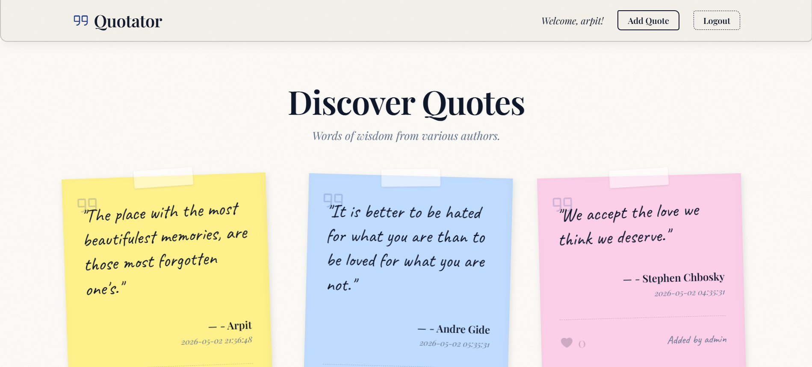

# Quotator 🖋️

Quotator is a premium, mobile-friendly Flask application designed for discovering, sharing, and discussing world-famous quotes. Featuring a unique "Ink Pen on Parchment" aesthetic, it combines modern functionality with a classic, hand-drawn feel.



## ✨ Features

- **Ink-Pen Aesthetic**: A beautiful UI featuring parchment textures, elegant typography (Caveat & Playfair Display), and realistic post-it note quote cards.
- **Input Validation**: Simple, efficient checking for restricted coding characters to prevent injection.
- **Interactive System**: Like and comment on your favorite quotes.
- **Guest Access**: Seamlessly browse and interact even without a formal account.
- **Mobile Optimized**: Fully responsive design with cascading transitions and custom mobile UI refinements.
- **Premium Animations**: Features a custom "scribbling" preloader and smooth staggered page entrance effects.

## 🚀 Getting Started

### Prerequisites

- Python 3.8+

### Local Development

1. Clone the repository:
   ```bash
   git clone https://github.com/ArkTrek/Quotator.git
   cd Quotator
   ```

2. Create a virtual environment and install dependencies:
   ```bash
   python -m venv venv
   source venv/bin/activate  # On Windows: venv\Scripts\activate
   pip install -r requirements.txt
   ```

3. Setup environment variables:
   ```bash
   cp .env.example .env
   # Edit .env with your secret key and settings
   ```

4. Run the application:
   ```bash
   python app.py
   ```

### 🐳 Production Deployment (Docker)

The project is production-ready with Docker and `waitress`/`gunicorn`:

```bash
docker-compose up --build -d
```

## 🛠️ Tech Stack

- **Backend**: Flask (Python)
- **Production Server**: Waitress (Windows) / Gunicorn (Linux)
- **Database**: TOON Data Manager (`python-toon`)
- **Frontend**: HTML5, Vanilla CSS3, JavaScript
- **Icons**: Phosphor Icons

## 🔒 Security & Production Grade Features

- **Environment Configuration**: Uses `python-dotenv` and separate `config.py` for dev/prod environments.
- **Structured Logging**: Implementation of Python's `logging` module for better observability.
- **Production WSGI**: Integrated with `waitress` and `gunicorn` for robust serving.
- **Containerization**: Full Docker support for consistent deployments.
- **Secret Management**: Sensitive keys are kept out of the source code.

## 👤 Author

**ARPIT RAMESAN**
- GitHub: [@ArkTrek](https://github.com/ArkTrek)
- Portfolio: [Arpit Ramesan](https://arpitramesansportfolio.pythonanywhere.com/)
- Email: arpitramesan777@gmail.com

---
*Preserving the world's wisdom in ink.*
